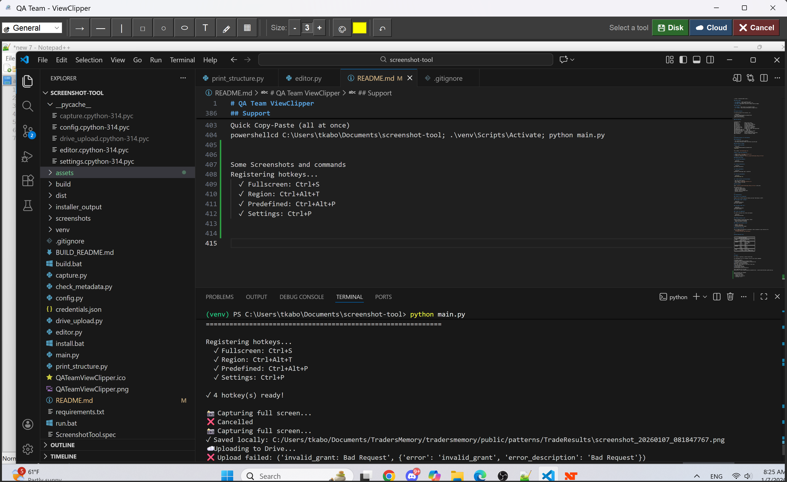
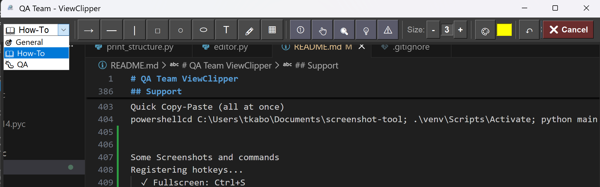
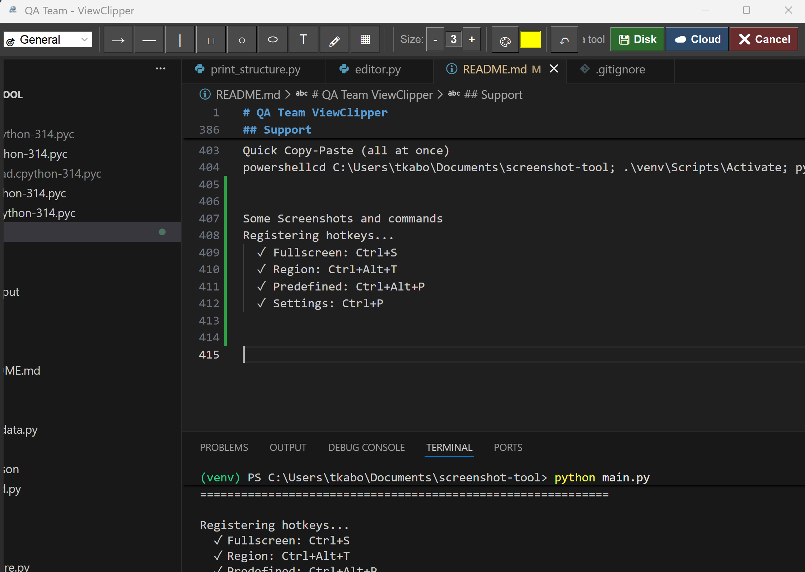
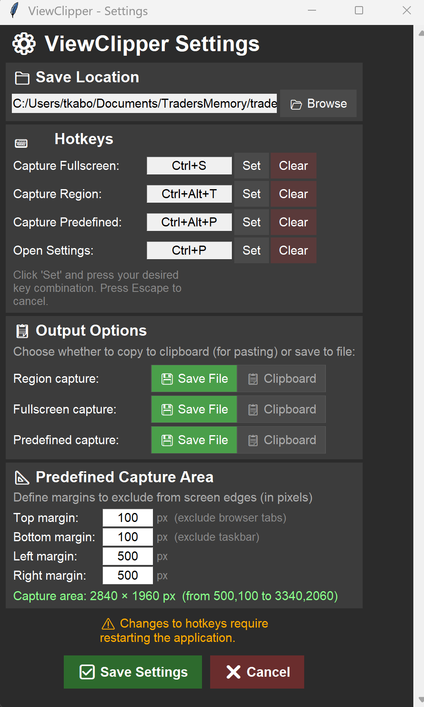
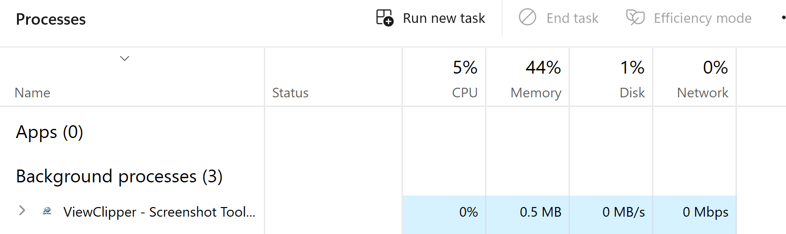

# QA Team ViewClipper

Screenshot tool with annotation features and Google Drive sync.


---

## Table of Contents

- [Installation (First Time Setup)](#installation-first-time-setup)
- [Daily Usage](#daily-usage)
- [Hotkeys](#hotkeys)
- [Changing Hotkeys](#changing-hotkeys)
- [Features](#features)
- [Project Structure](#project-structure)
- [Building Installer for Distribution](#building-installer-for-distribution)
- [Troubleshooting](#troubleshooting)

---

## Installation (First Time Setup)

### Prerequisites

1. **Python 3.10 or higher**
   - Download from: https://www.python.org/downloads/
   - During installation, CHECK ✅ "Add Python to PATH"

2. **Git** (optional, for cloning)
   - Download from: https://git-scm.com/downloads

### Step-by-Step Installation

**1. Open PowerShell or Command Prompt**

Press `Win + X` and select "Windows Terminal" or "PowerShell"

**2. Navigate to the project folder**

```powershell
cd C:\Users\tkabo\Documents\screenshot-tool
```

**3. Create virtual environment** (first time only)

```powershell
python -m venv venv
```

**4. Activate virtual environment**

```powershell
.\venv\Scripts\Activate
```

You should see `(venv)` appear at the start of your command line.

**5. Install dependencies**

```powershell
pip install -r requirements.txt
```

Or install manually:

```powershell
pip install pywin32 pillow google-api-python-client google-auth-httplib2 google-auth-oauthlib
```

**6. Test the installation**

```powershell
python main.py
```

You should see the ViewClipper startup message with hotkeys listed.

---

## Daily Usage

### Starting the Tool

**Option 1: Using PowerShell**

```powershell
cd C:\Users\tkabo\Documents\screenshot-tool
.\venv\Scripts\Activate
python main.py
```

**Option 2: Double-click `run.bat`** (if available)

Just double-click the `run.bat` file in the project folder.

### Stopping the Tool

Press `Ctrl+C` in the terminal window.

---

## Hotkeys

| Hotkey | Action | Output |
|--------|--------|--------|
| `Alt+S` | Capture full screen | Opens editor |
| `Alt+R` | Capture region (select area) | Copies to clipboard |
| `Ctrl+P` | Open settings window | - |
| `Ctrl+C` | Quit the tool | - |

### Inside the Editor

| Hotkey | Action |
|--------|--------|
| `Ctrl+Z` | Undo last action |
| `Enter` | Confirm/place element |
| `Escape` | Cancel current action |

---

## Changing Hotkeys

### Method 1: Using Settings Window

1. Press `Ctrl+P` while ViewClipper is running
2. Change hotkeys in the settings window
3. Click Save
4. Restart ViewClipper for changes to take effect

### Method 2: Edit settings.json

1. Open the file `settings.json` in the project folder (or `%LOCALAPPDATA%\ViewClipper\settings.json`)

2. Edit the hotkey values:

```json
{
    "hotkey_fullscreen": "Alt+S",
    "hotkey_region": "Alt+R",
    "hotkey_predefined": "",
    "hotkey_settings": "Ctrl+P",
    "region_copy_to_clipboard": true,
    "fullscreen_copy_to_clipboard": false,
    "predefined_copy_to_clipboard": false,
    "predefined_top_offset": 0,
    "predefined_bottom_offset": 50,
    "predefined_left_offset": 0,
    "predefined_right_offset": 0
}
```

3. Save the file and restart ViewClipper

### Available Hotkey Formats

| Type | Examples |
|------|----------|
| Single modifier + letter | `Alt+S`, `Ctrl+R`, `Shift+X` |
| Multiple modifiers | `Ctrl+Shift+S`, `Ctrl+Alt+R` |
| Function keys | `F9`, `Ctrl+F9`, `Alt+F1` |
| Special keys | `Alt+Space`, `Ctrl+Enter` |
| Disable hotkey | `""` (empty string) or `"(disabled)"` |

### Modifier Keys

- `Ctrl` - Control key
- `Alt` - Alt key
- `Shift` - Shift key

### Special Keys

`Space`, `Enter`, `Tab`, `Backspace`, `Delete`, `Insert`, `Home`, `End`, `PageUp`, `PageDown`, `Up`, `Down`, `Left`, `Right`, `Escape`, `F1`-`F24`

---

## Features

### Capture Modes

- **Fullscreen** - Captures entire screen
- **Region** - Click and drag to select area
- **Predefined** - Captures screen with custom margins

### Editor Tools

| Tool | Description |
|------|-------------|
| → Arrow | Draw arrows |
| — H-Line | Horizontal lines |
| \| V-Line | Vertical lines |
| □ Rectangle | Draw rectangles |
| ○ Circle | Draw circles |
| ⬭ Ellipse | Draw ellipses |
| T Text | Add text annotations |
| 🖍 Highlight | Freehand highlighter |
| ▦ Blur | Pixelate/redact areas |

### Editor Modes

- **🎯 General** - Basic annotation tools
- **📖 How-To** - Step numbers, pointers, tips
- **🐛 QA** - Bug markers, pass/fail stamps, severity badges

### Save Options

- **💾 Disk** - Save locally to screenshots folder
- **☁️ Cloud** - Save locally AND upload to Google Drive

---

## Project Structure

To view the project file structure, run:

```powershell
cd C:\Users\tkabo\Documents\screenshot-tool
.\venv\Scripts\Activate
python print_structure.py
```

### File Overview

```
screenshot-tool/
├── main.py              # Main entry point
├── editor.py            # Image editor window
├── capture.py           # Screen capture functions
├── settings.py          # Settings management
├── config.py            # Configuration constants
├── drive_upload.py      # Google Drive integration
├── credentials.json     # Google API credentials
├── token.json           # Google auth token (auto-generated)
├── QATeamViewClipper.ico    # App icon
├── QATeamViewClipper.png    # App logo
├── print_structure.py   # Project structure viewer
├── requirements.txt     # Python dependencies
├── settings.json        # User settings (auto-generated)
└── screenshots/         # Saved screenshots folder
```

---

## Building Installer for Distribution

### Prerequisites

- All installation steps completed
- Inno Setup installed (https://jrsoftware.org/isdl.php)

### Quick Build (2 Steps)

**Step 1: Build the EXE**

```powershell
cd C:\Users\tkabo\Documents\screenshot-tool
.\build.bat
```

This creates `dist\ViewClipper.exe`

**Step 2: Create the Installer**

1. Double-click `ViewClipper_Installer.iss`
2. Press `Ctrl+F9` to compile
3. Installer created at: `installer_output\ViewClipper_Setup_v1.0.0.exe`

### Manual Build Steps

**1. Activate environment**

```powershell
.\venv\Scripts\Activate
```

**2. Install PyInstaller**

```powershell
pip install pyinstaller
```

**3. Build executable**

```powershell
pyinstaller ViewClipper.spec --noconfirm
```

**4. Test the executable**

```powershell
.\dist\ViewClipper.exe
```

**5. Create installer with Inno Setup**

- Open Inno Setup Compiler
- File → Open → `ViewClipper_Installer.iss`
- Build → Compile (Ctrl+F9)

### Distribution

Share `installer_output\ViewClipper_Setup_v1.0.0.exe` with users.

The installer will:
- Install to Program Files
- Create Start Menu shortcut
- Optional: Desktop shortcut
- Optional: Start on Windows boot
- Include uninstaller

---

## Troubleshooting

### "python is not recognized"

Python is not in PATH. Reinstall Python and check "Add Python to PATH".

### "No module named 'win32api'"

```powershell
.\venv\Scripts\Activate
pip install pywin32
```

### "No module named 'PIL'"

```powershell
.\venv\Scripts\Activate
pip install pillow
```

### "(venv) not appearing"

You need to activate the virtual environment:

```powershell
.\venv\Scripts\Activate
```

### "Hotkey already in use"

Another program is using that hotkey. Either:
- Close the conflicting program
- Change the hotkey in settings

### "Google Drive upload failed"

1. Delete `token.json`
2. Restart ViewClipper
3. Re-authenticate with Google

### Antivirus blocks EXE

This is common with PyInstaller executables. Add an exception in your antivirus for:
- `dist\ViewClipper.exe`
- `C:\Program Files\QA Team ViewClipper\`

---

## Quick Reference Card

```
┌─────────────────────────────────────────────────┐
│           QA Team ViewClipper                   │
├─────────────────────────────────────────────────┤
│  START:     .\venv\Scripts\Activate             │
│             python main.py                      │
├─────────────────────────────────────────────────┤
│  HOTKEYS:   Alt+S     = Full screen             │
│             Alt+R     = Region select           │
│             Ctrl+P    = Settings                │
│             Ctrl+C    = Quit                    │
├─────────────────────────────────────────────────┤
│  EDITOR:    Ctrl+Z    = Undo                    │
│             Enter     = Confirm                 │
│             Escape    = Cancel                  │
├─────────────────────────────────────────────────┤
│  SAVE:      💾 Disk   = Local only              │
│             ☁️ Cloud  = Local + Google Drive    │
└─────────────────────────────────────────────────┘
```

---

## Support

For issues or questions, contact the QA Team.

For development you run it manually. Here are your daily commands:

Development Commands
1. Open PowerShell and go to project folder:
powershellcd C:\Users\tkabo\Documents\screenshot-tool
2. Activate virtual environment:
powershell.\venv\Scripts\Activate
You'll see (venv) appear at the start of the line.
3. Run the project:
powershellpython main.py
4. View project structure:
powershellpython print_structure.py

Quick Copy-Paste (all at once)
powershellcd C:\Users\tkabo\Documents\screenshot-tool; .\venv\Scripts\Activate; python main.py


Some Screenshots and commands
Registering hotkeys...
  ✓ Fullscreen: Ctrl+S

  ✓ Region: Ctrl+Alt+T

  ✓ Predefined: Ctrl+Alt+P

  ✓ Settings: Ctrl+P

Full Screen

Presets

Region

Settings


minimal process consumption
